# Compressed Chunk Export

## Purpose

Compressed chunk export is the fallback and advanced export format for large recordings. Instead of rendering PNG frames, MP4 video, or full metrics output in the browser, it writes the recorded packed-grid chunks directly into the ZIP with enough metadata to decode them later.

Use this format when a normal export would be too large, when the Download section forces chunk mode because the estimated working set is above $2\text{ GiB}$, or when you want to process the recording with your own tools.

## ZIP Layout

A compressed chunk export is still downloaded as `golt-export.zip`. In chunk mode, the ZIP contains:

```text
manifest.json
metadata.json
chunks/chunk-000000.bin
chunks/chunk-000001.bin
...
```

`manifest.json` describes the exported chunk payloads and selected range. `metadata.json` describes the grid, topology, boundary tribe, random seed, rules, and tribes needed to interpret numeric cell values and probabilistic rule behavior.

## manifest.json

The manifest has this shape:

```jsonc
{
  "version": 1, // Manifest version for compatibility
  "selectedRange": {
    "startFrame": 1,
    "endFrame": 120,
    "startGen": 0,
    "endGen": 119,
    "framesTotal": 120,
  },
  "chunks": [
    {
      "chunkId": 0,
      "filename": "chunk-000000.bin",
      "codec": "deflate-raw",
      "storedBytes": 12345,
      "uncompressedBytes": 1048576,
      "blockCount": 4,
      "generationStart": 0,
      "generationEnd": 3,
      "generations": [0, 1, 2, 3],
      "gridFormat": {
        "bitsPerCell": 8,
      },
      "source": "copied",
    },
  ],
}
```

Important fields:

- `selectedRange`: selected range from the Download UI. `startFrame` and `endFrame` are $1$-based UI frame numbers; `startGen` and `endGen` are the zero-based simulation generation numbers for the first and last exported frames.
- `chunks`: ordered chunk payload list.
- `chunk.filename`: file name under `chunks/`.
- `chunk.codec`: payload codec. `raw-packed` is an original simulation-packed chunk awaiting storage optimization; `stored-packed` is an optimized, uncompressed packed chunk; `deflate-raw` is an optimized packed chunk compressed with raw DEFLATE. Compression is retained only when it saves more than $10\%$, and payloads smaller than $4\text{ KiB}$ are kept as `stored-packed` without attempting compression.
- `chunk.storedBytes`: bytes stored in the ZIP entry before decoding.
- `chunk.uncompressedBytes`: bytes after decoding to packed frames.
- `chunk.blockCount`: number of frames in this chunk.
- `chunk.generations`: simulation generation number for each frame in the chunk.
- `chunk.gridFormat`: packing used by this chunk. This can differ from `metadata.json` `gridFormat.bitsPerCell`; always use the chunk value when decoding a chunk.
- `chunk.source`: `copied` when an entire source chunk was exported, `rebuilt` when a boundary chunk was rebuilt for a partial frame range.

## metadata.json

`metadata.json` contains:

```jsonc
{
  "cols": 512,
  "rows": 512,
  "topology": "toroidal",
  "boundaryTribe": "dead",
  "randomSeed": 42,
  "gridFormat": {
    "bitsPerCell": 8,
  },
  "rules": [
    // ...
  ],
  "tribes": [
    { "id": "dead", "color": "000000" },
    { "id": "Alive", "color": "ffffff" },
  ],
}
```

Important fields:

- `cols`, `rows`: grid dimensions for every frame.
- `topology`: grid edge behavior used by the simulation, either `toroidal` or `bounded`.
- `boundaryTribe`: virtual tribe used for off-grid neighbor reads in bounded mode.
- `randomSeed`: deterministic seed used by probabilistic rules.
- `gridFormat.bitsPerCell`: default packing for the recording.
- `rules`: rules used by the simulation, using the same persisted shape as [Rule JSON](Rule-Expressions#rule-json).
- `tribes`: tribe IDs and colors used to interpret packed cell values, using the same persisted shape as [Tribe JSON](Rule-Expressions#tribe-json).

The packed cell values in chunk frames are numeric indexes into `tribes`. A value of $0$ normally maps to `dead`, value $1$ maps to the second tribe, and so on. Use the tribe list to convert cell values into tribe IDs or colors.

## Chunk Payloads

Each chunk file contains `blockCount` packed frames concatenated together.

To decode a chunk:

1. Read `chunks/<filename>` from the ZIP.
2. If `codec` is `deflate-raw`, inflate it with raw DEFLATE, not zlib or gzip headers.
3. If `codec` is `raw-packed` or `stored-packed`, use the bytes as-is.
4. Compute frame size from `metadata.json` `cols`, `rows`, and the chunk's `bitsPerCell`, not the metadata default.
5. Split the decoded payload into `blockCount` frame-sized byte ranges.
6. Read each frame as little-endian `u32` words.
7. Unpack each cell from its word using the bit layout.
8. Map numeric values to `metadata.json` tribes.



Frame size formula:

$$
\begin{aligned}
\texttt{cellsPerWord} &= \frac{32}{\texttt{bitsPerCell}} \\[1.5em]
\texttt{packedCols} &= \left\lceil\frac{\texttt{cols}}{\texttt{cellsPerWord}}\right\rceil \\[1.5em]
\texttt{frameBytes} &= \texttt{packedCols}\cdot\texttt{rows}\cdot4
\end{aligned}
$$

Cell unpacking formula:

$$
\begin{aligned}
\texttt{wordIndex} &= y\cdot\texttt{packedCols}+\left\lfloor\frac{x}{\texttt{cellsPerWord}}\right\rfloor \\[1.5em]
\texttt{cellIndex} &= x\bmod\texttt{cellsPerWord} \\[1.5em]
\texttt{shift} &= \texttt{cellIndex}\cdot\texttt{bitsPerCell} \\[1.5em]
\texttt{value} &= (\texttt{word}\gg\texttt{shift})\mathbin{\&}\left((1\ll\texttt{bitsPerCell})-1\right)
\end{aligned}
$$

The grid is stored row-major. Cells beyond `cols` in the final packed word of a row are padding and should be ignored.

### Example Python Reader

This script reads a chunk export ZIP, prints its metadata, decodes frames, and writes the first decoded frame as `first-frame.csv` containing tribe IDs.

<details>
<summary>Python reader example</summary>

```python
#!/usr/bin/env python3
import csv
import json
import math
import struct
import sys
import zipfile
import zlib
from collections.abc import Iterator
from pathlib import Path
from typing import Any

Frame = dict[str, Any]
GridFormat = dict[str, int]

def grid_format(bits_per_cell: int) -> GridFormat:
  """Return packing constants for a bits-per-cell value.

  :param bits_per_cell: Number of bits used by one packed cell.
  :returns: A dictionary with the cell mask and cells-per-word count.
  :rtype: dict[str, int]
  """
  cells_per_word = 32 // bits_per_cell
  return {
    "bits_per_cell": bits_per_cell,
    "cells_per_word": cells_per_word,
    "cell_mask": (1 << bits_per_cell) - 1,
  }

def frame_byte_size(cols: int, rows: int, bits_per_cell: int) -> int:
  """Return the byte length of one packed frame.

  :param cols: Number of grid columns.
  :param rows: Number of grid rows.
  :param bits_per_cell: Number of bits used by one packed cell.
  :returns: The packed frame size in bytes.
  :rtype: int
  """
  fmt = grid_format(bits_per_cell)
  packed_cols = math.ceil(cols / fmt["cells_per_word"])
  return packed_cols * rows * 4

def inflate_chunk(data: bytes, codec: str) -> bytes:
  """Decode a chunk payload according to its manifest codec.

  :param data: Compressed or raw bytes read from the ZIP entry.
  :param codec: Codec name from the chunk manifest entry.
  :returns: Raw packed frame bytes.
  :rtype: bytes
  :raises ValueError: If the codec is not supported by this script.
  """
  if codec == "deflate-raw":
    return zlib.decompress(data, wbits=-zlib.MAX_WBITS)
  if codec == "raw-packed" or codec == "stored-packed":
    return data
  raise ValueError(f"Unsupported chunk codec: {codec}")

def unpack_frame(frame_bytes: bytes, cols: int, rows: int, bits_per_cell: int) -> list[list[int]]:
  """Unpack one frame into a two-dimensional list of tribe indexes.

  :param frame_bytes: Raw packed frame bytes.
  :param cols: Number of grid columns.
  :param rows: Number of grid rows.
  :param bits_per_cell: Number of bits used by one packed cell.
  :returns: A list of rows, where each value is a tribe index.
  :rtype: list[list[int]]
  """
  fmt = grid_format(bits_per_cell)
  packed_cols = math.ceil(cols / fmt["cells_per_word"])
  values: list[list[int]] = []

  for y in range(rows):
    row: list[int] = []
    for x in range(cols):
      word_index = y * packed_cols + (x // fmt["cells_per_word"])
      word = struct.unpack_from("<I", frame_bytes, word_index * 4)[0]
      shift = (x % fmt["cells_per_word"]) * bits_per_cell
      row.append((word >> shift) & fmt["cell_mask"])
    values.append(row)

  return values

def iter_frames(zip_path: str | Path) -> Iterator[Frame]:
  """Yield decoded frames from a compressed chunk export ZIP.

  :param zip_path: Path to the exported ZIP file.
  :returns: An iterator of frame dictionaries with generation, values, and metadata.
  :rtype: Iterator[dict[str, object]]
  :raises ValueError: If a decoded chunk has an unexpected byte length.
  """
  with zipfile.ZipFile(zip_path) as zf:
    manifest = json.loads(zf.read("manifest.json"))
    metadata = json.loads(zf.read("metadata.json"))
    cols = metadata["cols"]
    rows = metadata["rows"]
    tribes = metadata["tribes"]

    for chunk in manifest["chunks"]:
      bits = chunk.get("gridFormat", metadata["gridFormat"])["bitsPerCell"]
      frame_size = frame_byte_size(cols, rows, bits)
      raw_entry = zf.read(f"chunks/{chunk['filename']}")
      payload = inflate_chunk(raw_entry, chunk["codec"])
      expected_size = frame_size * chunk["blockCount"]

      if len(payload) != expected_size:
        raise ValueError(
          f"{chunk['filename']} decoded to {len(payload)} bytes, expected {expected_size}"
        )

      for local_index, generation in enumerate(chunk["generations"]):
        start = local_index * frame_size
        end = start + frame_size
        values = unpack_frame(payload[start:end], cols, rows, bits)
        yield {
          "generation": generation,
          "values": values,
          "tribes": tribes,
          "cols": cols,
          "rows": rows,
        }

def write_first_frame_csv(zip_path: str | Path, output_path: str | Path) -> None:
  """Write the first exported frame to a CSV file using tribe IDs.

  :param zip_path: Path to the exported ZIP file.
  :param output_path: Path where the CSV file should be written.
  :returns: ``None``. Writes the CSV file to disk.
  :rtype: None
  :raises ValueError: If the export does not contain any frames.
  """
  first = next(iter_frames(zip_path), None)
  if first is None:
    raise ValueError("No frames found in export")

  tribes = first["tribes"]
  with open(output_path, "w", newline="", encoding="utf-8") as handle:
    writer = csv.writer(handle)
    for row in first["values"]:
      writer.writerow([
        tribes[value]["id"] if value < len(tribes) else f"unknown:{value}"
        for value in row
      ])

  print(f"Wrote generation {first['generation']} to {output_path}")

def main() -> None:
  """Read an export ZIP and write its first frame as CSV.

  :returns: ``None``. Writes the first exported frame to disk.
  :rtype: None
  :raises SystemExit: If the command line arguments are invalid.
  """
  if len(sys.argv) != 2:
    raise SystemExit("Usage: python read_chunk_export.py golt-export.zip")

  zip_path = Path(sys.argv[1])
  with zipfile.ZipFile(zip_path) as zf:
    manifest = json.loads(zf.read("manifest.json"))
    metadata = json.loads(zf.read("metadata.json"))
    print(f"Grid: {metadata['cols']} x {metadata['rows']}")
    print(f"Topology: {metadata.get('topology', 'toroidal')}")
    print(f"Random seed: {metadata.get('randomSeed', 42)}")
    print(f"Frames: {manifest['selectedRange']['framesTotal']}")
    print(f"Chunks: {len(manifest['chunks'])}")
    print("Tribes:", ", ".join(tribe["id"] for tribe in metadata["tribes"]))

  write_first_frame_csv(zip_path, "first-frame.csv")

if __name__ == "__main__":
  main()
```

</details>

Run it with:

```bash
python read_chunk_export.py golt-export.zip
```

## Practical Uses

Once decoded, each frame is a grid of numeric tribe indexes. You can use it to:

- Render frames with your own palette.
- Compute custom metrics outside the browser.
- Convert selected frames to another simulation or analysis format.
- Reconstruct generation-by-generation state for offline experiments.
- Feed frames into Python, NumPy, image tools, or another cellular automata engine.

When processing long exports, stream $1$ chunk at a time instead of loading all chunks into memory.
