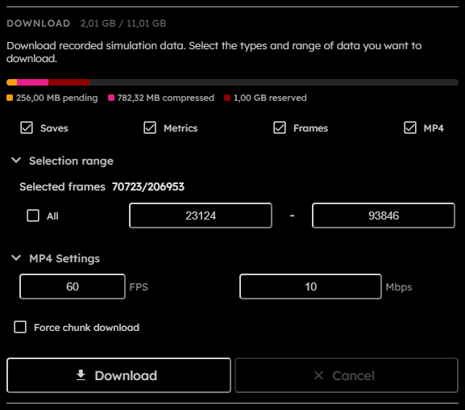

# Download

## Purpose

The Download section exports recorded simulation data. Downloads depend on recording: enable Rec in the Speed section before the part of the simulation you want to export.

## Controls

  

- **Storage bar**:  
  Shows pending raw recording bytes, compressed recording bytes, reserved recording headroom, and the browser-reported storage quota estimate.
- **Saves**:  
  Includes first and last `.golt` snapshots in the ZIP.  
  _This field is persisted across sessions._
- **Metrics**:  
  Includes metrics computed over selected recorded frames.  
  _This field is persisted across sessions._
- **Frames**:  
  Includes indexed PNG frames for selected recorded frames.  
  _This field is persisted across sessions._
- **MP4**:  
  Includes an MP4 video of selected recorded frames.  
  _This field is persisted across sessions._
- **Selection range**:  
  Chooses all recorded frames or a start/end frame range.
- **Selected frames**:  
  Read-only count of selected frames out of total recorded frames.
- **All**:  
  Selects all recorded frames.
- **Start frame**:  
  First selected $1$-based frame.
- **End frame**:  
  Last selected $1$-based frame.
- **MP4 FPS**:  
  Output frames per second. Persisted values are normalized between $1$ and $240$.  
  _This field is persisted across sessions._
- **MP4 Bitrate**:  
  Output bitrate in $\text{Mbps}$. Persisted values are normalized between $1$ and $60$.  
  _This field is persisted across sessions._
- **Force chunk download**:  
  Exports compressed recording chunks instead of selected rendered outputs.  
  _This field is persisted across sessions._
- **Progress**:  
  Shows active download progress and status.
- **Download**:  
  Starts the export. Disabled when no recorded frames exist, no outputs are selected, forms are invalid, simulation chunks are saving, a blocking operation is active, or the simulation is running.
- **Cancel**:  
  Requests cancellation of the active download. Disabled when no download is in progress.

## Storage Bar

The Download storage bar uses the same binary byte units as frame-size and VRAM displays.

- **Pending**: raw recorded chunks that still need compression.
- **Compressed**: recorded chunks already stored in their compressed/tight storage format.
- **Reserved**: storage headroom kept aside so recording can stop before browser storage is exhausted.
- **Quota estimate**: the browser-reported storage quota for the current origin.

The quota estimate is not device capacity, free disk space, or a guaranteed reservation. Browsers may round, cap, pad, or dynamically adjust it for privacy and storage-management reasons. Recording is disabled when quota minus pending, compressed, and reserved bytes is smaller than $1$ frame.

## Output Modes

Normal ZIP mode can include saves, metrics, PNG frames, and MP4. Before the worker starts, the app pauses the simulation, flushes pending recording frames, waits for needed compression, refreshes snapshot and recording manifests, then starts the download worker.

When Frames or MP4 are selected at the moment Download is clicked, the app captures a full-grid visual export framing origin. In toroidal topology, that origin is centered on the current viewport and unwraps the torus into a rectangular PNG frame or MP4 video. In bounded topology, the origin is the finite grid's top-left corner. A temporary grid-relative overlay marks the captured framing while the download is active. Panning or zooming after Download does not change the exported framing.

Saves, snapshots, metrics, and compressed chunk exports use the recorded grid data directly and are not shifted by the visual export framing. Bounded topology does not add stored boundary cells to any export; the boundary tribe remains virtual metadata.

Compressed chunk mode writes a chunk export instead of rendering selected outputs. It is selected when Force chunk download is enabled or when the estimated working set exceeds $2\text{ GiB}$. This mode copies whole selected chunks where possible and rebuilds boundary chunks when the selected frame range cuts through a chunk. The exported format is documented in [Compressed chunk export](Compressed-Chunk-Export).

The output file name is `golt-export.zip`.
