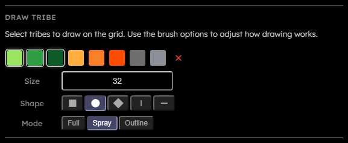

# Draw Tribe

## Purpose

**The Draw tribe section controls what pointer input writes into the grid. Drawing is live editor input**:  
it sends brush commands to the WebGPU worker, which mutates the active grid buffer and updates the render preview.

## Controls

  

- **Tribe swatches**:  
  One swatch is shown for each non-dead tribe. Clicking a swatch toggles it in the draw selection. Multiple selected tribes are used as random brush candidates.
- **Delete swatch**:  
  Toggles delete mode. Delete mode simply writes the `dead` tribe.
- **Size**:  
  Brush size in cells. The value is clamped between $1$ and $\frac{1}{4}$ of the smaller grid dimension. The UI shows `Min 1` or `Max N` when input is invalid or capped.  
  _This field is persisted across sessions._
- **Shape**:  
  Brush footprint. Available values are square, round, diamond, vertical line, and horizontal line.  
  _This field is persisted across sessions._
- **Mode**:  
  Brush fill behavior. `Full` targets every cell in the footprint, `Spray` treats the footprint as a randomized spray area, and `Outline` targets only the border of the chosen shape.  
  _This field is persisted across sessions._
- **Density**:  
  Brush density percentage for the current mode. The value is clamped from $1$ to $100$. Each mode stores its own density, so switching between `Full`, `Spray`, and `Outline` restores that mode's last value. Defaults are $100\%$ for `Full` and `Outline`, and $50\%$ for `Spray`.  
  In `Full` and `Outline` mode, cells in the footprint that are not selected by density stay unchanged. In `Spray` mode, cells in the footprint that are not selected by density become `dead`.  
  _This field is persisted across sessions._
- **Touch**:  
  Mobile-only control. `Draw` makes touch input paint cells, while `Pan` makes touch input move the camera. Two-finger touch always performs pinch zoom.

## Canvas Behavior

Left mouse or primary pointer input draws. Right mouse input pans. Mouse wheel zooms around the pointer. Touch input draws or pans depending on the Touch control, and $2$ active touch pointers switch to pinch zoom.

Brush edge behavior follows the grid topology from [Grid size](Grid-Size). In toroidal mode, brushes wrap across grid edges. Internally, a wrapped brush stroke is split into up to $4$ non-wrapping dispatch rectangles so the shader can update packed cells without special cross-edge writes inside $1$ dispatch. In bounded mode, brushes clip at the grid edge and do not paint the opposite side.
