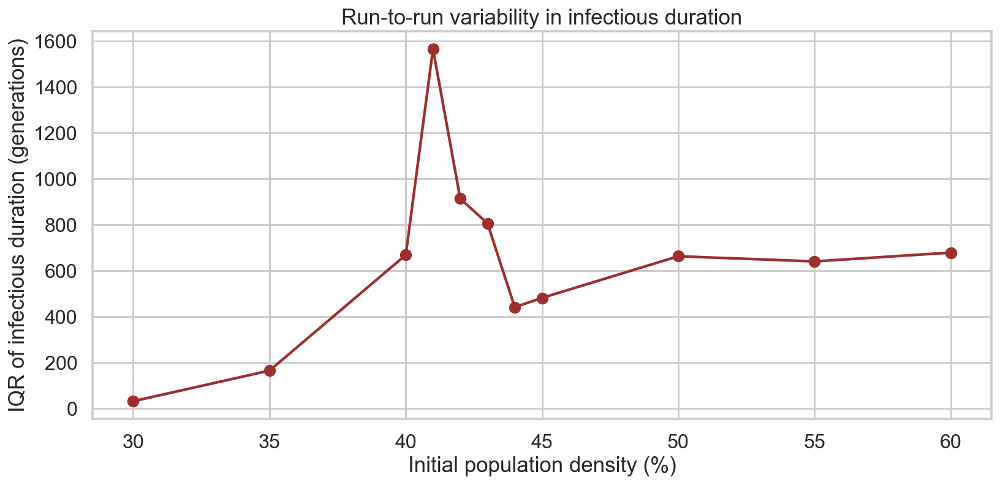
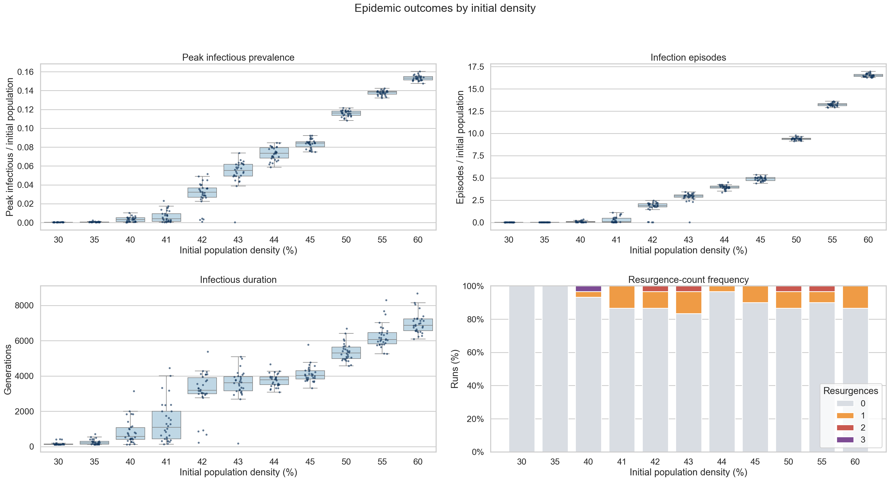
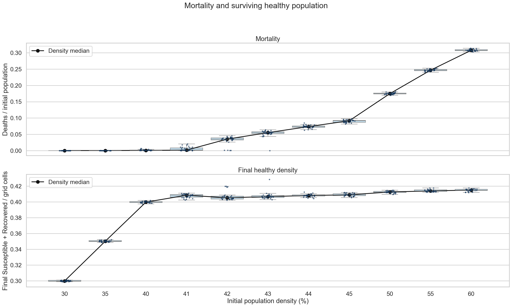
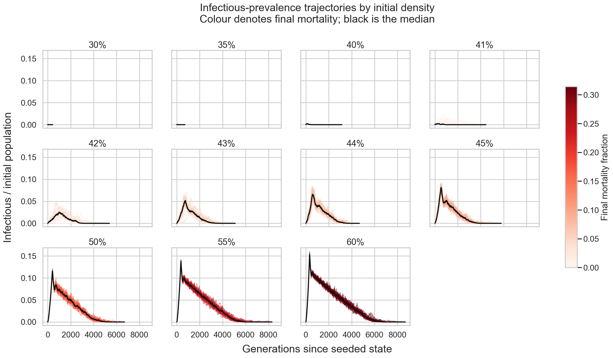
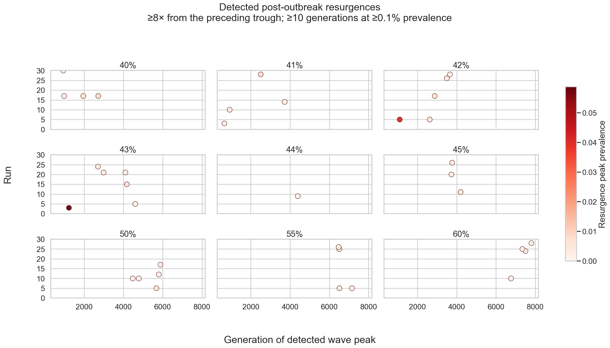
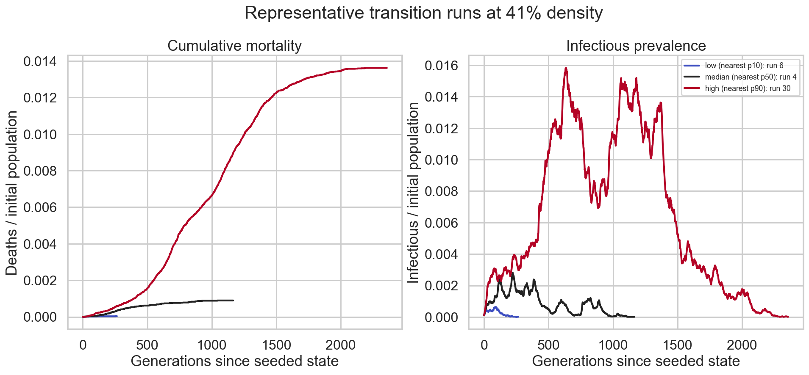

# Epidemic Analysis

## Preset Dynamics

The SIRSD Epidemic preset has $4$ cell states: `Dead`, `Susceptible`, `Infectious`, and `Recovered`. Its ordered rules are:

| Current state and condition                           | Next state    | Rule probability |
| ----------------------------------------------------- | ------------- | ---------------: |
| `Susceptible` with at least $1$ `Infectious` neighbor | `Infectious`  |           $50\%$ |
| `Infectious`                                          | `Recovered`   |            $5\%$ |
| `Infectious`, if the recovery roll did not apply      | `Dead`        |          $0.1\%$ |
| `Recovered`                                           | `Susceptible` |            $1\%$ |

Infection probability saturates at $1$ `Infectious` neighbor: having $2$ through $8$ `Infectious` neighbors does not increase the $50\%$ roll. Because rules are evaluated in order, the death roll is attempted only after the recovery roll fails. Given that rolls are independent, that makes the unconditional $1$-generation death probability approximately $0.95\cdot0.1\%=0.095\%$ for an `Infectious` cell.

`Recovered` cells can become `Susceptible` again, so reinfection and multiple waves are possible. `Dead` cells remain `Dead`. There are no births, movement, or incubation state.

## Derived Metrics

Initial population, written as $N_0$, is the first recorded `Susceptible + Infectious + Recovered` count. Empty grid cells are not included.

- **Prevalence**: current `Infectious` cells divided by fixed $N_0$.
- **Peak prevalence**: maximum unsmoothed prevalence during the run.
- **Mortality fraction**: deaths occurring during the run divided by $N_0$.
- **Final healthy grid density**: final $\frac{\texttt{Susceptible}+\texttt{Recovered}}{512^2}$. This uses the whole grid as its denominator.
- **Infectious duration**: final `Infectious` generation minus first recorded generation.
- **Time to peak**: peak-`Infectious` generation minus first recorded generation.

Using fixed $N_0$ for prevalence prevents deaths from shrinking the denominator and artificially inflating late prevalence.

### Infection Episodes

An infection episode is $1$ reconstructed `Susceptible → Infectious` transition. The initial $12$ seeded `Infectious` cells are not counted.  
With the preset's only $4$ possible transitions, the population deltas and `changed_cells` identify the aggregate flows exactly for consecutive generations.

If $C$ is `changed_cells`, the reconstruction is:

$$
R\rightarrow S = \frac{C + \Delta S - \Delta R - \Delta D}{3}
$$

$$
S\rightarrow I = R\rightarrow S - \Delta S
$$

$$
I\rightarrow R = \Delta R + R\rightarrow S
$$

$$
I\rightarrow D = \Delta D
$$

Episodes per initial population are cumulative $\frac{S\rightarrow I}{N_0}$. Values can exceed $1$ because the same population can pass through $R \rightarrow S \rightarrow I$ repeatedly. This is an event rate over the initial population, not the fraction of unique people ever infected and not a distribution of infections per individual.

## Density Outcomes

| Density | Median peak prevalence | $\frac{\textbf{Median episodes}}{N_0}$ | Median mortality | Median final healthy grid density | Median duration |
| ------: | ---------------------: | -------------------------------------: | ---------------: | --------------------------------: | --------------: |
|  $30\%$ |             $0.0312\%$ |                               $0.0006$ |       $0.0013\%$ |                       $29.9818\%$ |           $119$ |
|  $35\%$ |             $0.0537\%$ |                               $0.0016$ |       $0.0022\%$ |                       $35.0130\%$ |           $210$ |
|  $40\%$ |             $0.3033\%$ |                               $0.0309$ |       $0.0542\%$ |                       $39.9681\%$ |         $571.5$ |
|  $41\%$ |             $0.4034\%$ |                               $0.0717$ |       $0.1351\%$ |                       $40.8440\%$ |        $1\,092$ |
|  $42\%$ |             $3.2105\%$ |                               $1.8876$ |       $3.5189\%$ |                       $40.5214\%$ |      $3\,189.5$ |
|  $43\%$ |             $5.5147\%$ |                               $2.9605$ |       $5.4961\%$ |                       $40.6702\%$ |        $3\,621$ |
|  $44\%$ |             $7.3577\%$ |                               $3.9685$ |       $7.3550\%$ |                       $40.8045\%$ |        $3\,780$ |
|  $45\%$ |             $8.4398\%$ |                               $4.9194$ |       $9.1502\%$ |                       $40.9008\%$ |      $4\,021.5$ |
|  $50\%$ |            $11.6206\%$ |                               $9.3846$ |      $17.4787\%$ |                       $41.2521\%$ |        $5\,305$ |
|  $55\%$ |            $13.8507\%$ |                              $13.2581$ |      $24.6743\%$ |                       $41.3935\%$ |      $6\,072.5$ |
|  $60\%$ |            $15.3177\%$ |                              $16.5077$ |      $30.7825\%$ |                       $41.4928\%$ |      $6\,877.5$ |

The clearest observed change is between $41\%$ and $42\%$: median episodes per initial population increase from $0.0717$ to $1.8876$, peak prevalence from $0.403\%$ to $3.211\%$, mortality from $0.135\%$ to $3.519\%$, and duration from $1\,092$ to $3\,189.5$ generations.

Run-to-run variation in infectious duration is greatest at $41\%$: its IQR is $1\,566.25$ generations, compared with $669.25$ at $40\%$ and $914.5$ at $42\%$.

Resurgence count is explained [below](#resurgence-count).

## Mortality And Surviving Population

Above the transition, increased initial density supports many cycles of infection and substantially higher mortality. Median mortality reaches $30.783\%$ of the initial population at $60\%$ density.

Median final healthy grid density nevertheless stays in a narrow band from $40.521\%$ at $42\%$ to $41.493\%$ at $60\%$. This convergence is consistent with the regime transition observed between $41\%$ and $42\%$: at initial densities of $40\%$ or below, infection usually becomes extinct before spreading through enough of the population to cause substantial mortality, so final healthy density remains close to initial density. Above the transition, infection reaches a much larger part of the population and deaths progressively reduce occupancy. The epidemic therefore appears to prune densely populated grids toward a density at which continued transmission becomes difficult.

## Timing And Trajectories

Median duration increases throughout the sustained-epidemic regime, reaching $6\,877.5$ generations at $60\%$. Time to peak behaves differently: it is largest at $42\%$ with a median of $1\,010$ generations, then falls to $733$ at $43\%$, $535.5$ at $45\%$, $409$ at $50\%$, and $334$ at $60\%$. Once dense local connectivity supports sustained spread, higher density produces an earlier, larger peak but a longer period of repeated circulation.

The spaghetti plots show all $30$ prevalence trajectories per density. Color denotes final mortality and the black curve is the per-generation median.

## Resurgence Count

Resurgence is a retrospective event definition applied to prevalence, not a native engine metric.

1. Smooth prevalence with an $11$-generation centered mean. The window suppresses short cell-level fluctuations while keeping $5$ generations of context on either side.
2. Start a candidate wave when smoothed prevalence reaches $0.15\%$.
3. End it after smoothed prevalence remains at or below $0.05\%$ for $25$ consecutive generations.
4. Treat the first candidate as the initial outbreak.
5. Count a later candidate as a resurgence only if its smoothed peak is at least $8$ times the preceding smoothed trough, it spends at least $10$ generations at or above $0.15\%$, and the trough is above $0$.

The event's reported peak prevalence is the unsmoothed maximum inside its interval. Because the smoother is centered, this is an offline detector that uses future and past values; it is not suitable for real-time alerts.

Across all $330$ runs:

- $300$ runs have no resurgence.
- $25$ have $1$.
- $4$ have $2$.
- $1$ has $3$.
- $30$ runs, or $9.09\%$, have at least $1$, for $36$ qualifying resurgence events in total.
- No qualifying resurgence occurs at $30\%$ or $35\%$.

Counts are sparse and non-monotonic, so they support occasional post-outbreak resurgence but not a density-dependent resurgence law.

### Three-Resurgence Example

At $40\%$ density, run $17$ contains $3$ qualifying resurgences after its initial outbreak. In the recording, rendered at $30\text{ generations/s}$, the first occurs at generation $660$ ($\sim00{:}22$), the second at generation $1\,700$ ($\sim00{:}57$), and the third at generation $2\,400$ ($\sim01{:}20$). They subsequently peak at generations $980$ ($\sim00{:}32$), $1\,956$ ($\sim01{:}05$), and $2\,720$ ($\sim01{:}30$), with unsmoothed peak prevalences of approximately $0.345\%$, $0.567\%$, and $0.776\%$, respectively.  
The recording provides a concrete example of the retrospective event definition above.

<video controls muted playsinline preload="metadata" width="100%">
  <source src="../analysis/epidemic_res/videos/epidemic-40-run-17-two-resurgences.mp4" type="video/mp4">
  Your browser does not support embedded video.
</video>

## Representative Runs

The transition figure uses $41\%$, where the infection-episode IQR is largest, and selects actual runs nearest the $10\text{th}$, $50\text{th}$, and $90\text{th}$ episode percentiles:

| Representative role       |  Run | $\frac{\textbf{Episodes}}{N_0}$ | Peak prevalence |  Mortality | Duration |
| ------------------------- | ---: | ------------------------------: | --------------: | ---------: | -------: |
| Nearest $\mathrm{p}_{10}$ |  $6$ |                       $0.00298$ |      $0.0632\%$ | $0.0037\%$ |    $264$ |
| Nearest $\mathrm{p}_{50}$ |  $4$ |                       $0.04927$ |      $0.2809\%$ | $0.0893\%$ | $1\,166$ |
| Nearest $\mathrm{p}_{90}$ | $30$ |                       $0.75524$ |      $1.5825\%$ | $1.3619\%$ | $2\,358$ |

### Transition Runs In Motion

These recordings use the same $41\%$ initial density and correspond to the low-, median-, and high-outcome representatives above. They expose the run-to-run variation hidden by a density-level median.

|                                                                                          Low outcome – Run $\mathbf{6}$                                                                                           |                                                                                          Median outcome – Run $\mathbf{4}$                                                                                           |                                                                                          High outcome – Run $\mathbf{30}$                                                                                          |
| :---------------------------------------------------------------------------------------------------------------------------------------------------------------------------------------------------------------: | :------------------------------------------------------------------------------------------------------------------------------------------------------------------------------------------------------------------: | :----------------------------------------------------------------------------------------------------------------------------------------------------------------------------------------------------------------: |
| <video controls muted playsinline preload="metadata" width="100%"><source src="../analysis/epidemic_res/videos/epidemic-41-run-06-low.mp4" type="video/mp4">Your browser does not support embedded video.</video> | <video controls muted playsinline preload="metadata" width="100%"><source src="../analysis/epidemic_res/videos/epidemic-41-run-04-median.mp4" type="video/mp4">Your browser does not support embedded video.</video> | <video controls muted playsinline preload="metadata" width="100%"><source src="../analysis/epidemic_res/videos/epidemic-41-run-30-high.mp4" type="video/mp4">Your browser does not support embedded video.</video> |
|                                                                                  $0.0632\%$ peak prevalence $264$ generations                                                                                  |                                                                                  $0.2809\%$ peak prevalence $1\,166$ generations                                                                                  |                                                                                 $1.5825\%$ peak prevalence $2\,358$ generations                                                                                 |

## Typical Runs Across Regimes

The following median-like runs contrast rapid extinction at $30\%$ with sustained circulation and extensive mortality at $60\%$. To keep the long $60\%$ recording practical to view, it is rendered at $120\text{ generations/s}$, or $4\times$ the $30\text{ generations/s}$ used for the other videos. Its accelerated playback is a presentation choice made to reduce size and length and should not be used to compare visual propagation speed directly with other recordings.

|                                                                                      Typical $\mathbf{30\%}$ – Run $\mathbf{20}$                                                                                      |                                                                                      Typical $\mathbf{60\%}$ – Run $\mathbf{14}$                                                                                      |
| :-------------------------------------------------------------------------------------------------------------------------------------------------------------------------------------------------------------------: | :-------------------------------------------------------------------------------------------------------------------------------------------------------------------------------------------------------------------: |
| <video controls muted playsinline preload="metadata" width="100%"><source src="../analysis/epidemic_res/videos/epidemic-30-run-20-typical.mp4" type="video/mp4">Your browser does not support embedded video.</video> | <video controls muted playsinline preload="metadata" width="100%"><source src="../analysis/epidemic_res/videos/epidemic-60-run-14-typical.mp4" type="video/mp4">Your browser does not support embedded video.</video> |
|                                                                        $0.0344\%$ peak prevalence $0.0013\%$ mortality $152$ generations                                                                        |                                                                      $15.327\%$ peak prevalence $30.735\%$ mortality $6\,273$ generations                                                                       |
