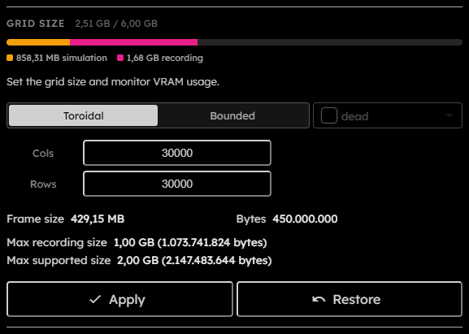

# Grid Size

## Purpose

The Grid size section changes the number of columns, rows, and edge topology used by the simulation. It also shows how large $1$ packed frame will be and whether the chosen size fits the current device and recording constraints.

## Controls

  

- **VRAM usage bar**:  
  Shown above the grid form in the sidebar section header. It separates simulation VRAM and recording VRAM against the detected budget.
- **Topology**:  
  Segmented control with `Toroidal` and `Bounded` modes. Toroidal grids wrap across opposite edges. Bounded grids keep a finite edge and use virtual boundary cells for off-grid neighbor reads.  
  _This field is persisted across sessions._
- **Boundary tribe**:  
  Selects the virtual tribe returned by off-grid neighbor reads in bounded mode. The select is disabled when topology is `Toroidal`.  
  _This field is persisted across sessions._
- **Cols**:  
  Column count. Minimum accepted value is $3$.
- **Rows**:  
  Row count. Minimum accepted value is $3$.
- **Frame size**:  
  Read-only estimate for $1$ packed grid frame using the current packing value.
- **Bytes**:  
  Exact frame byte count.
- **Max recording size**:  
  Maximum frame size that can be recorded on the current device, capped by application limits.
- **Max supported size**:  
  Maximum frame size supported by WebGPU buffer limits for the current device.
- **Apply**:  
  Commits the grid settings. Disabled while running, downloading, invalid, unchanged, or over the allowed frame limit.
- **Restore**:  
  Resets the fields back to the previously committed grid settings. Disabled while downloading or unchanged.

## Topology

`Toroidal` is the default topology. Neighbor reads, brush strokes, rendering offsets, and visual export framing wrap around the grid edges, so the grid behaves like a continuous surface.

`Bounded` keeps the stored frame size unchanged. Boundary cells are virtual: they are not stored in the packed grid, snapshot payload, recording frames, or exported chunks. Only off-grid neighbor reads resolve to the selected boundary tribe. Brush strokes clip at the grid edge instead of wrapping to the opposite side, and panning is clamped so the finite grid remains in view.

Changing topology or boundary tribe rebuilds the WebGPU engine because the simulation shader is specialized for those settings.

## Frame Limits

Frame limits tell you whether the grid can be used safely with the current packing and device. The exact byte math is covered in [VRAM and packing](VRAM-and-Packing).  
If the frame is above the supported limit, Apply is disabled because the worker would not be able to allocate the needed GPU buffers. If it is above the recording limit but still supported, the grid can still run, but recording will be unavailable.

Changing the grid triggers an engine rebuild. The app keeps the current ruleset, chooses a fitting simulation packing format when necessary, resets live metrics, and clamps the brush size if the old brush no longer fits the smaller grid.
