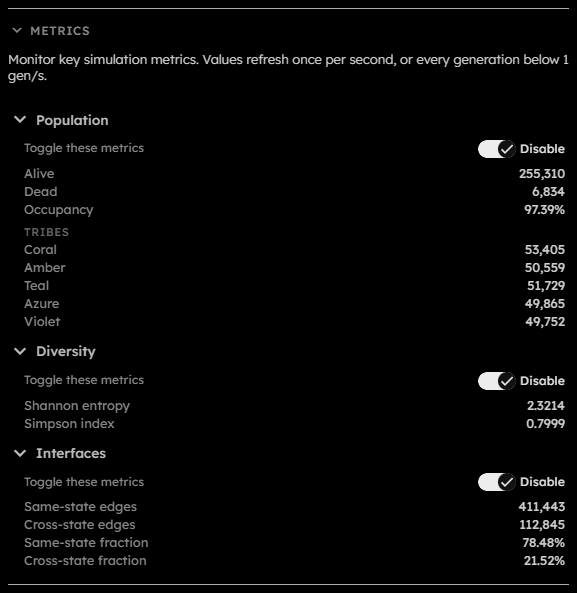

# Metrics

## Purpose

The Metrics section displays live measurements from the simulation. Live metrics refresh about once per second, or every generation below $1\text{ gen/s}$. They are useful for watching population balance, diversity, and boundaries while a simulation runs.

## Controls

  

- **Population subsection**:  
  Expands or collapses population values.
- **Diversity subsection**:  
  Expands or collapses diversity values.
- **Interfaces subsection**:  
  Expands or collapses interface values.
- **Toggle these metrics**:  
  Each subsection has an Enable / Disable toggle. These toggles are disabled when global live metrics are off in the Speed section.  
  _These fields are persisted across sessions._

## Values

If a live metric section is disabled, values display as `disabled`. If a section is too large for the GPU counter limits, values display as `unavailable`.

| Metric                   | Section    | Description                                                                                      |
| ------------------------ | ---------- | ------------------------------------------------------------------------------------------------ |
| **Alive**                | Population | Cells that are not `dead`.                                                                       |
| **Dead**                 | Population | Cells in the `dead` tribe.                                                                       |
| **Occupancy**            | Population | Alive cells divided by total cells.                                                              |
| **Tribe rows**           | Population | One row for each non-dead tribe showing its population.                                          |
| **Shannon entropy**      | Diversity  | How evenly alive cells are distributed across tribes. Higher values mean more even distribution. |
| **Simpson index**        | Diversity  | Probability that $2$ randomly selected alive cells belong to different tribes.                   |
| **Same-state edges**     | Interfaces | Orthogonal neighbor edges connecting cells with the same state.                                  |
| **Cross-state edges**    | Interfaces | Orthogonal neighbor edges connecting cells with different states.                                |
| **Same-state fraction**  | Interfaces | Same-state edges divided by total contact edges.                                                 |
| **Cross-state fraction** | Interfaces | Cross-state edges divided by total contact edges.                                                |

Toroidal grids include wrapped contacts across opposite edges. Bounded grids count only contacts between cells inside the finite grid; virtual boundary cells and opposite-edge wrapping are excluded.
