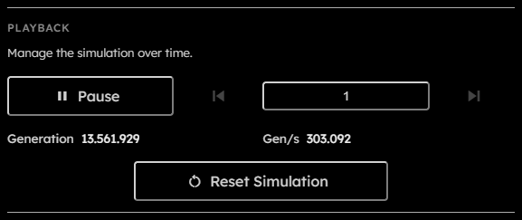

# Playback

## Purpose

The Playback section manages time in the simulation. It starts and stops the simulation, steps to target generations, shows the current generation and measured generation rate, and resets the current setup.

## Controls

  

- **Run / Pause**:  
  Starts the simulation or pauses the active run. The button changes icon and label depending on whether the simulation is running or a multi-step skip is active.
- **Step back**:  
  Moves backward by the current skip amount. This depends on recorded history, so it is disabled when no step-back data is available. Disabled also while the simulation is running.
- **Skip amount**:  
  Positive integer number of generations used by both step buttons. The value is persisted in local preferences and is clamped to at least `1`.  
  _This field is persisted across sessions._
- **Step forward**:  
  Advances by the current skip amount at max speed. Disabled while the simulation is running.
- **Generation**:  
  Read-only counter for the latest generation reported by the engine.
- **Gen/s**:  
  Read-only measured generations per second from the engine metrics stream.
- **Reset Simulation**:  
  Restarts the simulation from the current ruleset and grid setup, clears transient recording/download state, clears temporary OPFS data, and rebuilds the engine state.

## Busy States

Playback controls are disabled while the app is downloading, rebuilding the WebGPU resources, waiting for recording backpressure, or already stepping.  
While a long step operation is active, the canvas shows a skip overlay. Pausing during that state cancels the active step operation.
