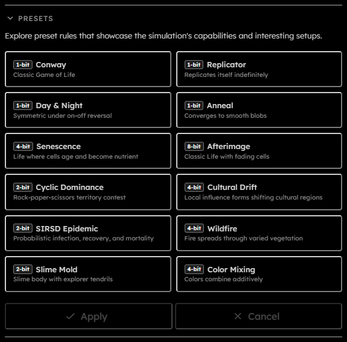
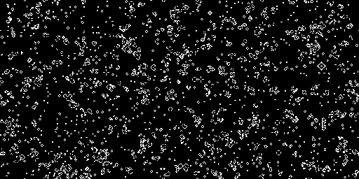
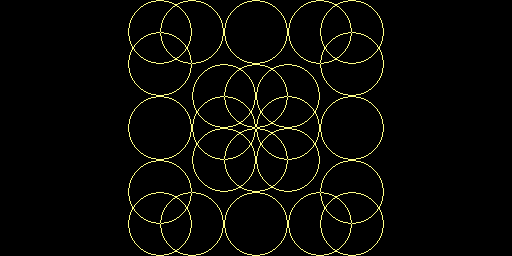

# Presets

## Purpose

The Presets section loads example rulesets that demonstrate the rule system. Presets keep the current grid dimensions, topology, and boundary tribe, but replace tribes, rules, and random seed metadata. They are useful starting points for classic Life-like automata, lifecycle rules, trails, territory, and multi-state material simulations.

## Controls

  

- **Preset buttons**:  
  Each button shows the preset name, short description, and minimum required packing.
- **Apply**:  
  Commits the selected preset. Disabled while running, downloading, or when no preset is selected.
- **Cancel**:  
  Clears the current preset selection without changing the simulation.

When a preset is applied, the app checks whether the preset's tribe count can fit the current grid under current WebGPU frame-size limits. If not, it shows an error asking you to reduce the grid size before applying the preset.

Presets can define their own random seed for probabilistic rules.

## Built-In Presets

| Preset           | Description                                      | Minimum packing |
| ---------------- | ------------------------------------------------ | --------------- |
| Conway           | Classic Game of Life                             | $1$-bit         |
| Replicator       | Replicates itself indefinitely                   | $1$-bit         |
| Day & Night      | Symmetric under on-off reversal                  | $1$-bit         |
| Anneal           | Converges to smooth blobs                        | $1$-bit         |
| Senescence       | Life where cells age and become nutrient         | $4$-bit         |
| Afterimage       | Classic Life with fading cells                   | $8$-bit         |
| Cyclic Dominance | Rock-paper-scissors territory contest            | $2$-bit         |
| Cultural Drift   | Local influence forms shifting cultural regions  | $4$-bit         |
| SIRSD Epidemic   | Probabilistic infection, recovery, and mortality | $2$-bit         |
| Wildfire         | Fire spreads through varied vegetation           | $4$-bit         |
| Slime Mold       | Slime body with explorer tendrils                | $2$-bit         |
| Color Mixing     | Colors combine additively                        | $4$-bit         |

The minimum packing shown on each button is derived from the number of tribes in that preset. For example, $2$-state presets can use $1$-bit packing, while presets with many lifecycle or material states need a larger value.

### Conway

Conway is the original two-state Game of Life: cells are born with exactly three living neighbors and survive with two or three. Its small ruleset produces familiar still lifes, oscillators, spaceships, and long-lived chaotic patterns.

  

**Tips to start:** Draw a small random patch with the Live tribe, then try simple patterns such as a block, blinker, glider, or lightweight spaceship. Slow the simulation down when a pattern becomes interesting so you can identify its repeating structure.

### Replicator

Replicator is a HighLife-style rule that supports self-copying patterns. Small seeds can expand into recurring fragments that fill large areas while continually producing new copies of their original structure.

  

**Tips to start:** Use a small spray-painted seed rather than filling the grid. Let it evolve at a moderate speed and leave enough empty space around it to watch separate copies emerge and interact.

### Day & Night

Day & Night is a Life-like rule with a complementary symmetry: swapping living and dead cells produces an equally valid evolution. Dense and sparse regions therefore create similarly rich structures.

<!-- MEDIA SLOT — Day & Night preset screenshot or animation. -->

**Tips to start:** Paint both a sparse patch and a dense patch of Live cells. Compare how the two regions evolve, then invert your intuition by treating the empty background as part of the pattern.

### Anneal

Anneal smooths irregular cell clusters into rounded, slowly changing blobs. It is useful for observing local majority behavior and how small gaps, islands, and thin connections disappear or merge over time.

<!-- MEDIA SLOT — Anneal preset screenshot or animation. -->

**Tips to start:** Start with a noisy spray-painted region at medium density. Watch the initial noise settle, then add a few narrow bridges or holes to see which features remain after the rule smooths them.

### Senescence

Senescence extends Life with visible stages of aging. Spark cells mature through successive living states, leave nutrient-like remnants, and can support later regrowth, creating expanding frontiers and evolving interior tissue.

<!-- MEDIA SLOT — Senescence preset screenshot or animation. -->

**Tips to start:** Begin with a small seed of Spark. Wait for the frontier to expand, then reignite the interior by adding more Spark cells.

### Afterimage

Afterimage preserves the behavior of classic Life while giving dead cells a long cyan fade. The trailing age states make the motion and history of gliders, oscillators, and chaotic regions visible long after a living cell has moved on.

<!-- MEDIA SLOT — Afterimage preset screenshot or animation. -->

**Tips to start:** Draw a glider or a small random Live-cell seed on an otherwise empty grid. Run slowly at first to follow the fading trail, then increase the speed once several moving patterns are present.

### Cyclic Dominance

Cyclic Dominance is a three-tribe rock-paper-scissors contest. Each color can overtake one rival and be overtaken by another, producing moving fronts, rotating spirals, and continually shifting territories.

<!-- MEDIA SLOT — Cyclic Dominance preset screenshot or animation. -->

**Tips to start:** Select all three tribes, use a spray brush, and paint the whole grid. Then start the simulation and let the competing territories form naturally.

### Cultural Drift

Cultural Drift models local influence among five cultures. Neighboring cells tend to align with nearby majorities, forming broad colored regions that may appear settled before slower boundary changes eventually decide the remaining competition.

<!-- MEDIA SLOT — Cultural Drift preset screenshot or animation. -->

**Tips to start:** Select all tribes, choose a full brush, and paint the entire grid. Let it run until it looks stable, then increase the simulation speed to reveal that it is still changing. Repeat with progressively higher speeds until only one tribe remains.

### SIRSD Epidemic

SIRSD Epidemic models susceptible, infectious, and recovered populations with probabilistic infection, recovery, mortality, and loss of immunity. It can produce localized waves, repeated outbreaks, and strong sensitivity to the initial population layout.

<!-- MEDIA SLOT — SIRSD Epidemic preset screenshot or animation. -->

**Tips to start:** Use a full brush at low density to paint the whole grid, deliberately leaving areas with different densities. Add a small number of Infectious cells, then watch the epidemic unfold.

### Wildfire

Wildfire simulates fire moving through grass, bushes, and trees with different resistance levels. Embers, fire, blaze, char, and rock make the spread, burnout, and firebreak effects visible across a heterogeneous landscape.

<!-- MEDIA SLOT — Wildfire preset screenshot or animation. -->

**Tips to start:** Paint vegetation across the whole grid with a spray brush at 90% density, then ignite even a very small area and compare how differently each run spreads. Add Rocks to make firebreaks, or unmute the vegetation-reproduction rule to explore regrowth.

### Slime Mold

Slime Mold separates an advancing Head state from stable Body tissue and food. Tendrils explore empty space, grow rapidly near food, and leave behind a connected body that can launch new exploratory heads.

<!-- MEDIA SLOT — Slime Mold preset screenshot or animation. -->

**Tips to start:** Add a small initial seed containing only Head cells and watch it slowly spread across the grid. Optionally add patches of Food to observe rapid local growth.

### Color Mixing

Color Mixing uses red, green, and blue primary tribes that combine into cyan, magenta, yellow, and ultimately white. Neighbor interactions make additive color blending visible as neighboring patches exchange and recombine colors.

<!-- MEDIA SLOT — Color Mixing preset screenshot or animation. -->

**Tips to start:** Either draw three bands of primary colors and watch them slowly mix into secondary colors and then white, or select only the three primary colors, use a full brush at 100% density to paint the whole grid, and watch primary-color patches exchange smaller patches of white and a secondary color.
