# Recording And OPFS

## Recording Buffers

Recording captures packed simulation frames so the app can step backward and export frame-based outputs. The worker keeps a GPU chunk buffer and a staging ring for readback. The staging ring has $3$ buffers.

Recording is available only when $1$ packed frame is no larger than the current max recording bytes. Max recording bytes are capped at $1\text{ GiB}$ and also limited by the device simulation buffer limits.



## Recorded Run Encoding

Recording runs cannot use ordinary simulation skip batches because every generation must be captured. Instead, max-speed recording and fixed-speed recording encode ordered step/copy pairs into a recording command batch:

```text
compute generation N + 1
copy generation N + 1 into the open recording chunk
compute generation N + 2
copy generation N + 2 into the open recording chunk
submit the encoded command buffer
```

The copy for each generation is encoded immediately after its matching simulation step, so no generations are skipped or overwritten. The worker submits the current recording batch when the pump deadline is reached, the target generation is reached, the open chunk becomes full, or recording backpressure prevents accepting more frames. Chunk sealing happens only after the command buffer containing the chunk's frame copies has been submitted.

Single-frame capture paths still use the standalone frame-copy encoder; the batched encoder is for active recording runs.

## Chunks

Recording chunks are written under the OPFS directory `gol-recording`. Each chunk has metadata:

- `chunkId`
- `filename`
- `generationStart`
- `generationEnd`
- `blockCount`
- `codec`
- `storedBytes`
- `uncompressedBytes`
- `gridFormat`
- ordered `generations`

Chunk capacity is chosen from a preferred $256\text{ MiB}$ chunk buffer cap, or $1$ frame when a single frame is larger than that cap:

$$

\begin{aligned}
\texttt{targetChunkBytes} &=
\begin{cases}
\min\left(256\text{ MiB},\,\texttt{maxRecordingBytes}\right), & \texttt{frameBytes}<256\text{ MiB} \\
\texttt{frameBytes}, & \text{otherwise}
\end{cases} \\[1.5em]
\texttt{chunkFrameCapacity} &= \left\lfloor\frac{\texttt{targetChunkBytes}}{\texttt{frameBytes}}\right\rfloor
\end{aligned}
$$

## Compression

Every sealed chunk is first persisted to OPFS with the `raw-packed` codec. This identifies a raw simulation-packed chunk that has not yet completed storage optimization.

The compression worker chooses the tightest storage grid format that can represent the configured tribes. When its bits per cell differ from the simulation grid format, the worker repacks every frame before considering compression. It then selects the stored representation as follows:

- Packed payloads smaller than $4\text{ KiB}$ skip compression and use `stored-packed`.
- Larger payloads are compressed with raw DEFLATE.
- The compressed payload is kept as `deflate-raw` only when it is less than $90\%$ of the packed payload, meaning that it saves more than $10\%$.
- Otherwise, the packed payload is retained as `stored-packed`.

The `stored-packed` codec therefore means that storage optimization completed without retaining DEFLATE output. Its bytes may use tighter packing than the original `raw-packed` chunk, or may be unchanged when the simulation format was already optimal. The compression worker updates the chunk codec, stored size, and grid-format metadata after processing.

Compression retry behavior:

- Failed compression jobs retry up to $3$ delayed attempts.
- Initial retry delay is $2\,000\text{ ms}$.
- Deferred chunks can be requeued up to $3$ times before being left raw.

## Backpressure

Recording applies backpressure when the worker cannot safely keep accepting frames. Backpressure can happen when staging buffers are unavailable or too many OPFS writes are pending.

Important limits:

- Maximum pending OPFS writes: $12$.
- Pending raw OPFS write byte budget: $512\text{ MiB}$.
- Pending compression byte budget: $1\text{ GiB}$.
- Major buffer allocation yield threshold: $512\text{ MiB}$.

When backpressure is active, the UI shows an overlay and running simulation waits until recording data catches up.

## Storage Quota

The worker reports storage quota snapshots that include browser-reported usage, the browser-reported quota estimate, pending raw bytes, compressed bytes, and reserved recording headroom. The quota estimate is not device capacity, free disk space, or a guaranteed reservation. Browsers may round, cap, pad, or dynamically adjust it for privacy and storage-management reasons, so it can appear to grow while recording data is written and shrink after compression.

Storage classes shown by the app:

- **Pending**: raw recorded chunks that still need compression.
- **Compressed**: recorded chunks already stored in their compressed/tight storage format.
- **Reserved**: recording headroom kept aside so recording can stop before browser storage is exhausted.
- **Quota estimate**: the browser-reported storage quota for the current origin.

Effective recording usage is pending raw bytes plus compressed bytes plus reserved bytes. The home page warns at $25\%$, $50\%$, $75\%$, and $100\%$ effective recording usage compared with the quota estimate. At $75\%$ it pauses the simulation. At $100\%$ it pauses and disables recording. Recording is also disabled whenever quota minus pending, compressed, and reserved bytes is smaller than $1$ frame.

Quota estimates are preventive and may not match the browser's actual write limit. If OPFS rejects a recording chunk write because storage quota was reached, the app stops recording instead of treating it as a GPU error. The failed chunk is discarded, the simulation is paused, and the grid is restored to the persisted frame before the newest saved frame so there is room for compression and cleanup. If no earlier persisted frame exists, the recorded history is cleared.
