# Rules Engine Internals

## Rule Semantics

Each generation evaluates every real grid cell independently against the current grid. Edge behavior depends on the selected topology:

- `Toroidal`: neighbor reads wrap across opposite edges.
- `Bounded`: neighbor positions outside the grid resolve to the selected virtual boundary tribe.

Bounded boundary cells are virtual. They are not stored in the frame and are not evaluated as cells; they only affect off-grid neighbor reads.

Rules are evaluated in order:

1. Muted rules or rules with probability $0$ are skipped.
2. A rule whose clause matches performs its probability roll.
3. The first matching rule whose probability roll passes assigns the next state.
4. If no rule matches, or if matching probabilistic rules all fail their rolls, the cell becomes `dead`.

A rule has $3$ behavioral parts:

- Clause: boolean expression over the current cell and its neighbors.
- Probability: percentage chance that a matched rule applies.
- Outcome: expression that computes the next tribe id.

For the full selector, clause, outcome, tribe, and rule JSON reference, see [Rule expressions](Rule-Expressions). This page focuses on evaluation behavior and shader generation.

Probability uses deterministic randomness. The roll is derived from the cell coordinates, generation, rule index, and ruleset random seed, so the same snapshot, rules, seed, and generation reproduce the same outcomes. Rules with probability $100\%$ do not roll; once their clause matches, they apply through the same direct path as a deterministic rule. Failed probability rolls fall through to later rules instead of ending the first-match chain.

## Expression Handling

Selectors, clauses, and outcomes are normalized before comparison, persistence, and shader generation. The normalized form keeps equivalent editor states stable and gives shader generation predictable inputs.

- Explicit tribe selector signatures sort and deduplicate selected tribe IDs for stable lookup keys.
- Count-style clauses operate on the $8$ Moore neighbors, and count values are clamped to $0$ through $8$.
- Count-style clause bounds compile to the smallest equivalent boolean expression: `none` and `exactly` use equality, `min` uses only a lower-bound check, `max` uses only an upper-bound check, partial `count` intervals use a two-sided range, and always-true ranges such as `count 0..8`, `min 0`, and `max 8` compile to `true`.
- Empty clauses are editor placeholders. They compile as false, and the editor rejects applied rules that still contain empty placeholders.

## Dynamic Outcomes

Ranked outcomes evaluate eligible neighbor tribes selected by the outcome selector:

- `majority` chooses the most common eligible neighbor tribe.
- `minority` chooses the least common eligible neighbor tribe with a non-zero count.

The generated shader tracks the best candidate, best count, and tie count. A single winner writes that candidate. A tie evaluates the configured tie outcome with the `tie` selector bound to the tied candidates. If no candidate exists, the fallback outcome is evaluated.

Combine outcomes build a bit mask of participating inputs. Lookup rows are sorted so rows explicitly requiring `dead` are checked before less specific rows. If no row matches, the default outcome is evaluated.

## Shader Generation

`generateComputeWgsl` converts the normalized rule list and grid topology into WGSL:

- It specializes neighbor reads for toroidal or bounded topology.
- In toroidal topology, it emits the fast wrapping reads.
- In bounded topology, it emits virtual off-grid reads that return the selected boundary tribe.
- In bounded topology, packed words whose valid cells are all interior use direct neighbor reads for every lane. Edge-containing words keep per-cell interior checks and use boundary-aware reads only where needed.
- It collects unique count selectors to avoid repeating the same neighbor-count expression. Always-true count clauses do not collect a selector unless another clause needs the same count.
- It collects comparison selectors and reuses count variables when possible.
- It emits a local variable for each unique count selector.
- It emits clause expressions as optimized WGSL boolean expressions, including direct equality or one-sided comparisons for count clauses when a full two-sided range is unnecessary.
- It emits outcomes as assignments to `result`.
- It emits one first-match-wins branch chain over active rules, with deterministic probability guards where needed.
- It emits direct assignment branches for $100\%$ rules, even when other active rules in the same shader are probabilistic.
- It emits a random-seed constant and hash helper only when active probabilistic rules require probability rolls.

Unknown rule tribe references log an error and fall back to the `dead` tribe index. The editor tries to prevent those cases before rules are applied.
