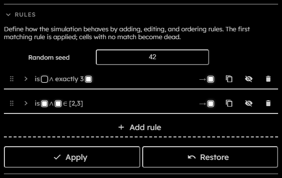
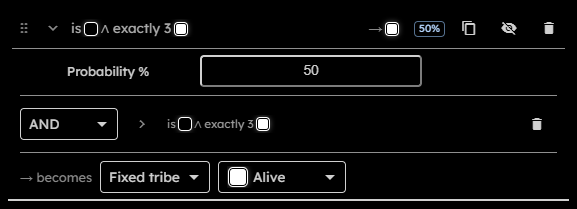
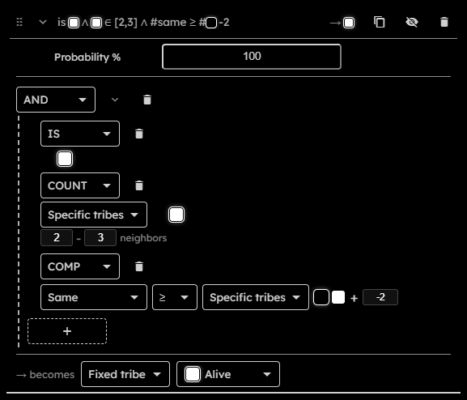
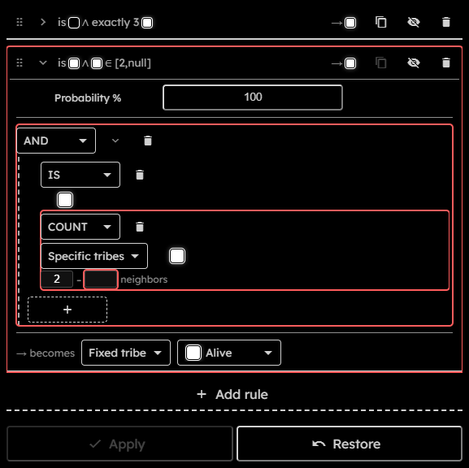

# Rules

## Purpose

The Rules section defines how each cell becomes its next state. Rules are evaluated from top to bottom. The first matching unmuted rule whose probability roll passes wins. If no rule matches or all matching probabilistic rules fail their rolls, the cell becomes `dead`.

This page explains the editor controls. For runtime behavior and shader generation, see [Rules engine internals](Rules-Engine-Internals). For the persisted rule JSON shape used by snapshots and exports, see [Rule JSON](Rule-Expressions#rule-json).

## Rule List Controls

  

- **Random seed**:  
  Deterministic seed used by per-rule probability rolls. Changing the seed changes future probabilistic rule outcomes while preserving deterministic replay for the same state, rules, seed, and generation.
- **Drag handle**:  
  Reorder a rule. Rule order is part of behavior, so dragging can change the simulation outcome.
- **Expand / collapse**:  
  Opens or closes the rule editor body.
- **Summary**:  
  Compact description of the rule clause.
- **Output label or swatch**:  
  Compact display of what the rule produces.
- **Duplicate rule**:  
  Inserts a cloned rule below the current rule.
- **Mute / unmute**:  
  Temporarily disables or enables the rule without deleting it. Muted rules are skipped by the runtime.
- **Delete rule**:  
  Removes the rule from the list.
- **Add rule**:  
  Creates a new expanded rule with an empty clause and a fixed output to the first non-dead tribe.
- **Apply**:  
  Commits valid rule changes. Disabled while running, downloading, unchanged, or invalid.
- **Restore**:  
  Discards rule edits and restores previously committed rules.

## Probability Controls

  

Each expanded rule has a **Probability %** field at the top of the rule body. The field is a percentage with exactly $3$ decimal digits.  
When a rule has a probability below $100\%$, the collapsed rule header shows a compact percentage badge. $0$ effectively disables the rule, as if it was muted.

At runtime, a rule must first match its clause. If it has a probability below $100\%$, the engine then performs a deterministic probability roll. A failed roll does not stop evaluation; the next rules can still match and apply.

## Clause Controls

  

Each rule has $1$ root clause. Logical clauses can contain nested clauses.

- **Clause type**:  
  Select `IS`, `COUNT`, `NONE`, `EXACTLY`, `MIN`, `MAX`, `COMP`, `NOT`, `AND`, `OR`, or `XOR`.
- **Delete clause**:  
  Replaces or removes the selected clause. If a logical group would have too few children, the removed child becomes an empty placeholder.
- **Group collapse**:  
  Hides nested clauses and shows a summary for `AND`, `OR`, `XOR`, and `NOT` groups.
- **Add child**:  
  Adds an empty child to `AND`, `OR`, or `XOR` groups.
- **Tribe swatches**:  
  Used by `IS` and other explicit selector clauses to select tribes.
- **Selector editor**:  
  Used by count-style clauses and comparison sides. It can target specific tribes, the same tribe as the current cell, tribes different from the current cell, or tribes different from the current cell within a selected subset.
- **Count inputs**:  
  Neighbor values must be integers from $0$ to $8$ because the engine uses the $8$-cell Moore neighborhood. Invalid edits stay visible and block Apply.
- **Comparison operator**:  
  One of `=`, `!=`, `>`, `<`, `>=`, or `<=`.
- **Comparison margin**:  
  Integer from $-8$ to $8$ added to the right-hand comparison count.

Clause meanings:

| Clause    | Meaning                                                                                      |
| --------- | -------------------------------------------------------------------------------------------- |
| `IS`      | Current cell is one of the selected tribes.                                                  |
| `COUNT`   | Selected neighbor count is inside the specified inclusive range.                             |
| `NONE`    | Selected neighbor count is $0$.                                                              |
| `EXACTLY` | Selected neighbor count equals `N`.                                                          |
| `MIN`     | Selected neighbor count is at least `N`.                                                     |
| `MAX`     | Selected neighbor count is at most `N`.                                                      |
| `COMP`    | One selected neighbor count is compared with another selected count plus an optional margin. |
| `NOT`     | Inverts one child clause.                                                                    |
| `AND`     | All child clauses must match.                                                                |
| `OR`      | At least one child clause must match.                                                        |
| `XOR`     | An odd number of child clauses must match.                                                   |

## Outcome Controls

The outcome editor starts with a `becomes` mode selector:

- **Fixed tribe**:  
  Cell becomes $1$ selected tribe.
- **Same**:  
  Cell keeps its current tribe.
- **Majority**:  
  Cell becomes the most common selected neighbor tribe.
- **Minority**:  
  Cell becomes the least common selected neighbor tribe with a non-zero count.
- **Combine**:  
  Cell uses a lookup table over selected inputs.

Ranked outcomes have extra controls:

- **Majority of / Minority of**:  
  Selector used to choose candidates.
- **Tie**:  
  What happens when multiple candidates tie. Options are fixed tribe, same, or combine.
- **Fallback**:  
  What happens when no ranked candidate exists. Options are fixed tribe, same, or combine.

Combine outcomes use lookup rows:

- **Inputs**:  
  One or more selectors in an unordered combination row. Inputs can be concrete tribes, Same, Different, and in tie contexts the active Majority or Minority candidates.
- **Add input / remove input**:  
  Changes the inputs for one row. A row can have at most $8$ inputs and cannot repeat the same input.
- **Output tribe**:  
  Fixed tribe produced by that row.
- **Remove row**:  
  Deletes the row.
- **Otherwise**:  
  Default output when no row matches.
- **Add combination row**:  
  Creates another lookup row.

## Error Outlines

  

Invalid rules cannot be applied. Common invalid states are empty clauses, selectors with no tribe, references to removed tribes, missing tie/fallback behavior, duplicate combine rows, invalid combination inputs, invalid random seed values, or invalid probability values.

The editor marks invalid rule structures with red outlines so the blocking part can be traced from the rule card down to the specific nested clause or field:

- A rule with any invalid content gets a red outline around the rule card.
- A clause gets a red outline when that clause, one of its fields, or any descendant clause is invalid.
- A numeric clause field gets its own red outline when its value is invalid, for example when it is empty or outside the allowed count range.
- `EMPTY` placeholder clauses are invalid and also mark their parent clauses and rule as invalid.
