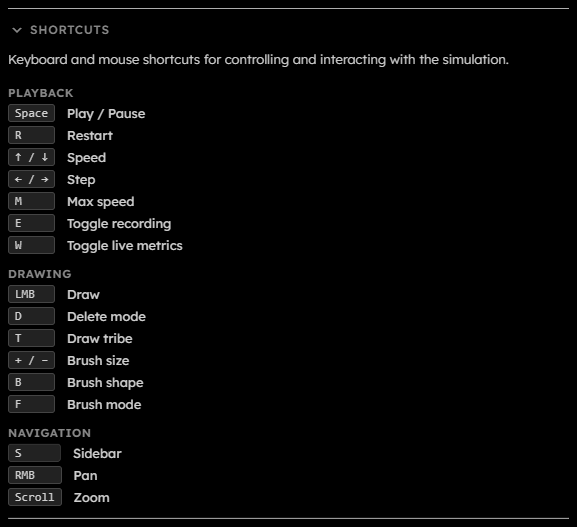

# Shortcuts

## Purpose

The Shortcuts section lists keyboard and pointer controls, available for desktop-mode only. Keyboard shortcuts are ignored while a text input, select, or textarea owns focus, and most shortcuts are blocked while a GPU error, rebuild, or backpressure overlay is active.

  

## Playback Shortcuts

| Shortcut     | Action                                                                    |
| ------------ | ------------------------------------------------------------------------- |
| Space        | Play / pause. During a step operation, Space cancels stepping.            |
| R            | Restart the simulation.                                                   |
| Up / Down    | Increase or decrease fixed target speed. Down clamps at $1\text{ gen/s}$. |
| Left / Right | Step backward or forward by $1$ generation.                               |
| M            | Toggle max speed.                                                         |
| E            | Toggle recording when recording is available.                             |
| W            | Toggle live metrics globally.                                             |

## Drawing Shortcuts

| Shortcut          | Action                                                         |
| ----------------- | -------------------------------------------------------------- |
| Left mouse button | Draw with the current selected tribes or erase in delete mode. |
| D                 | Toggle delete mode.                                            |
| T                 | Cycle the single selected non-dead draw tribe.                 |
| + / -             | Increase or decrease brush size.                               |
| B                 | Cycle brush shapes.                                            |
| F                 | Cycle brush fill modes.                                        |

## Navigation Shortcuts

| Shortcut           | Action                                    |
| ------------------ | ----------------------------------------- |
| S                  | Open or close the sidebar.                |
| Right mouse button | Pan the view.                             |
| Scroll             | Zoom in or out around the pointer.        |
| Touch pan mode     | One-finger touch pans instead of drawing. |
| Two-finger touch   | Pinch zoom.                               |
