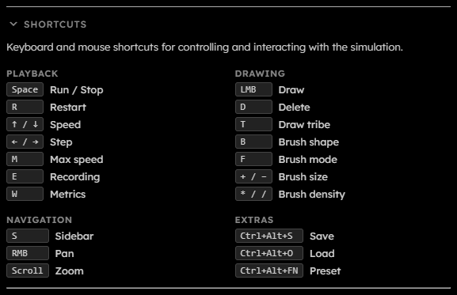

# Shortcuts

## Purpose

The Shortcuts section lists keyboard and pointer controls, available for desktop-mode only. Most keyboard shortcuts are ignored while a text input, select, or textarea owns focus, and many are blocked while a GPU error, rebuild, or backpressure overlay is active.

  

## Playback Shortcuts

| Shortcut | Action                                                                      |
| -------- | --------------------------------------------------------------------------- |
| `Space`  | Run/Stop the simulation. During a step operation, `Space` cancels stepping. |
| `R`      | Restart the simulation.                                                     |
| `↑ / ↓`  | Increase or decrease fixed target speed. Down clamps at $1\text{ gen/s}$.   |
| `← / →`  | Step backward or forward by $1$ generation.                                 |
| `M`      | Toggle max speed.                                                           |
| `E`      | Toggle recording when recording is available.                               |
| `W`      | Toggle live metrics globally.                                               |

## Drawing Shortcuts

| Shortcut            | Action                                                         |
| ------------------- | -------------------------------------------------------------- |
| `Left Mouse Button` | Draw with the current selected tribes or erase in delete mode. |
| `D`                 | Toggle delete mode.                                            |
| `T`                 | Cycle draw tribes.                                             |
| `+ / -`             | Increase or decrease brush size.                               |
| `* / /`             | Increase or decrease brush density.                            |
| `B`                 | Cycle brush shapes.                                            |
| `F`                 | Cycle brush fill modes.                                        |

## Snapshot And Preset Shortcuts

| Shortcut                    | Action                                                                                   |
| --------------------------- | ---------------------------------------------------------------------------------------- |
| `Ctrl+Alt+S `               | Save a snapshot when saving is available.                                                |
| `Ctrl+Alt+O `               | Open the file picker to load a snapshot when loading is available.                       |
| `Ctrl+Alt+F1` through `F12` | Apply built-in `N`th preset, where `N` is the function-key number from $1$ through $12$. |

## Navigation Shortcuts

| Shortcut             | Action                                    |
| -------------------- | ----------------------------------------- |
| `S`                  | Open or close the sidebar.                |
| `Right Mouse Button` | Pan the view.                             |
| `Scroll`             | Zoom in or out around the pointer.        |
| Touch in `Pan` mode  | One-finger touch pans instead of drawing. |
| Two-finger touch     | Pinch zoom.                               |
