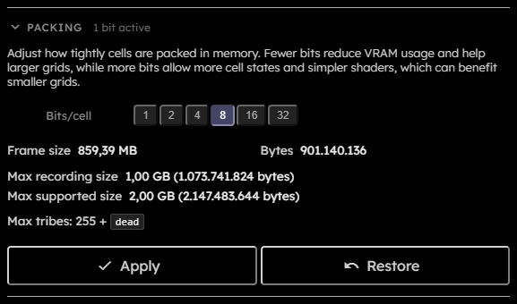

# Snapshot

## Purpose

The Snapshot section saves or loads the current simulation state as a `.golt` file. Snapshots are restartable state, not rendered media. Use downloads for PNG, MP4, metrics, and recorded-frame exports.

## Controls

  

- **Progress status**:  
  Shows snapshot save/load progress. Large snapshots can show determinate progress while streaming or decompressing grid data.
- **Save**:  
  Requests a snapshot from the engine, serializes it in a snapshot worker, and downloads a `.golt` file.
- **Load**:  
  Opens a file picker for `.golt` files and loads the selected snapshot.

Both Save and Load are disabled while running, downloading, stepping, saving, or loading.

## Snapshot Contents

A `.golt` snapshot contains:

- Grid columns and rows.
- Grid topology.
- Virtual boundary tribe.
- Random seed for probabilistic rules.
- Generation counter.
- Packed grid data.
- Grid packing metadata.
- Tribe IDs and colors, using the [Tribe JSON](Rule-Expressions#tribe-json) shape.
- Rules, using the [Rule JSON](Rule-Expressions#rule-json) shape.

Boundary cells for bounded topology are not stored in the grid payload. The snapshot stores only the selected boundary tribe; off-grid neighbor reads reconstruct the virtual boundary behavior after loading.

For the low-level file layout and how to parse it, see [Snapshot format](Snapshot-Format).

Loading a snapshot rebuilds the engine if grid, topology, tribes, rules, random seed, or packing need new GPU resources.
