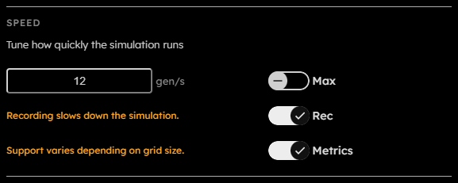

# Speed

## Purpose

The Speed section controls how quickly the engine advances generations and whether extra runtime features are enabled. Recording and live metrics toggles are placed here because both directly affect simulation throughput.

## Controls

  

- **Target speed**:  
  Positive integer fixed target in generations per second.  
  _This field is persisted across sessions._
- **Max**:  
  Toggles max-speed mode. In max-speed mode, the engine advances as fast as the current grid, rules, recording state, metrics state, and device allow. Rendering is paused while max speed is active, allowing for faster speeds compared to setting a target speed.  
  _This field is persisted across sessions._
- **Rec**:  
  Toggles recording. Recording stores frames so the app can step backward and export recorded outputs. It is disabled if the current frame is too large for recording.  
  _This field is persisted across sessions._
- **Metrics**:  
  Toggles live metrics globally. Section-level metric toggles still live in the Metrics section.  
  _This field is persisted across sessions._

## Recording And Metrics Cost

The UI warns that recording slows down the simulation because frames must be copied into recording buffers, read back through staging buffers, and persisted to OPFS. If the grid is too large for recording, the Rec toggle is disabled and the message changes to say that the grid is too large.

Live metrics also slow down the simulation due to additional GPU work, but the effect is minor to negligible.
