# Technical Architecture

## Runtime Pieces

The website is an Angular application. The home page owns high-level state and preferences, while the `gol-engine` component owns the canvas and worker transport. The simulation itself runs in `src/app/feature/home/worker/webengine.ts`, not on the Angular main thread.

Main pieces:

- **Angular home page**:  
  Coordinates ruleset state, random seed, grid topology settings, sidebar events, preferences, snackbars, snapshots, downloads, wake lock, and worker output.
- **Sidebar components**:  
  Edit user-facing controls and emit typed sidebar events.
- **Engine component**:  
  Transfers an `OffscreenCanvas` to the worker, forwards input messages, and emits worker output messages back to the home page.
- **Webengine worker**:  
  Owns WebGPU device/context, GPU buffers, compute/render pipelines, simulation run loop, recording buffers, OPFS recording chunks, live metrics, brush updates, snapshots, topology-specialized shaders, and step-back.
- **Snapshot worker**:  
  Builds and parses `.golt` files.
- **Compression workers**:  
  Compress sealed recording chunks in the background.
- **Download worker**:  
  Writes ZIP output, metrics, PNG frames, MP4, `.golt` saves, or compressed chunk export.

## Architecture Diagram

The engine component creates the webengine worker. The home page and home-side helper classes create the utility workers: the snapshot runner starts `snapshot.ts`, the compression scheduler starts `compress.ts`, and the download runner starts `download.ts`. Compression is coordinated by the home page: sealed chunks come back from the engine as messages, home-side compression workers process them, and the home page tells the engine to update the stored chunk codec.

## Message Flow

The flow is mostly one-way at each layer:

1. Sidebar emits `SidebarEvent` values.
2. Home page updates local state or calls engine methods.
3. Engine component posts typed messages to the webengine worker.
4. Webengine worker updates GPU state and posts typed output messages.
5. Engine component emits outputs to the home page.
6. Home page updates the sidebar inputs, overlays, snackbar state, download estimate, and preferences.

Examples:

- `setRuleset` sends rules, random seed, tribes, and topology metadata, then triggers worker rebuild and eventually a limits message.
- `setGridSize` updates grid dimensions, topology, or boundary tribe and triggers a worker rebuild.
- `draw` sends a brush stroke to the worker and applies it to the current grid buffer. The worker wraps or clips the brush dispatch according to topology.
- `getSnapshot` requests packed grid state, topology metadata, and random seed from the worker.
- `getRecording` asks the worker to seal pending recording state and return a manifest.

## Workers

The project uses workers to keep expensive work off the UI thread:

- `webengine.ts`:  
  Simulation, rendering, recording, live metrics, OPFS recording writes.
- `snapshot.ts`:  
  `.golt` save/load serialization and parsing.
- `compress.ts`:  
  Raw deflate compression for recorded chunks.
- `download.ts`:  
  ZIP export and selected output generation.

The app uses OPFS for large temporary and recording data. The browser-reported storage quota estimate is monitored and reported to the UI, with warnings at $25\%$, $50\%$, $75\%$, and $100\%$ effective usage. Effective usage is pending raw recording bytes plus compressed recording bytes plus reserved recording headroom. Recording is disabled when the remaining quota is smaller than $1$ frame. The quota estimate is approximate and may change as the browser manages storage.
