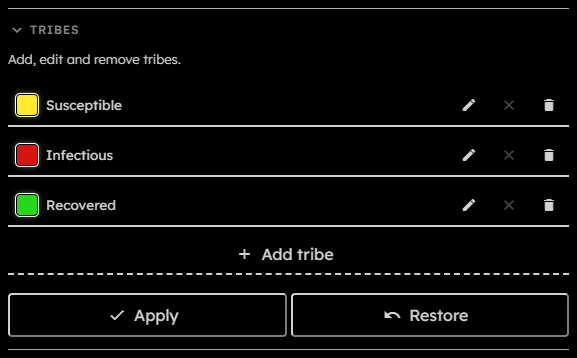
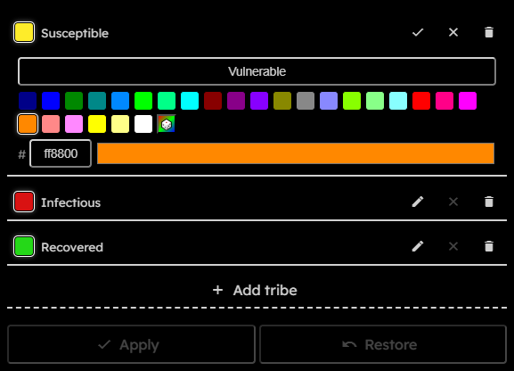
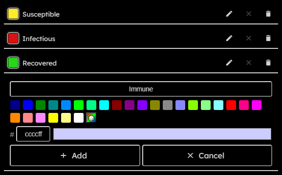

# Tribes

## Purpose

The Tribes section edits the named cell states used by drawing, rules, bounded-grid boundaries, rendering, snapshots, and exports. Every ruleset includes the special `dead` tribe for empty cells; the UI only lists editable non-dead tribes. For the persisted tribe JSON shape, see [Tribe JSON](Rule-Expressions#tribe-json).

## Tribe List Controls

  

- **Tribe swatch**:  
  Shows the tribe's current color.
- **Tribe name**:  
  Shows the tribe's current ID.
- **Edit / confirm**:  
  Opens the editor for an existing tribe. While editing, the same button becomes a check mark that confirms the tribe draft in the list.
- **Discard edit**:  
  Closes an open editor and restores that tribe's values from before editing began.
- **Remove**:  
  Removes the tribe from the list. Existing references may prevent that removal from being applied.
- **Add tribe**:  
  Opens a separate editor with an empty name and a random color.
- **Apply**:  
  Commits the complete tribe list. It is disabled while the simulation is running, a download is active, nothing has changed, the list is empty or invalid, a tribe is still being edited, or a rule, packing, or active bounded-boundary constraint blocks the change.
- **Restore**:  
  Discards all additions, edits, and removals and restores the previously committed tribe list.

## Editing A Tribe

  

1. Select **Edit** on an existing tribe.
2. Change its **Name** or color. The color can be selected from the palette, randomized, entered as a $6$-character RGB hex value without `#`, or chosen with the browser's native color picker.
3. Select the check-mark button to confirm the edit. This updates the tribe list but does not yet change the running ruleset.
4. Select **Apply** at the bottom of the section to commit all tribe changes.

While a tribe editor is open, its close button discards its unconfirmed changes and restores the values from before the editor was opened. The check-mark button is enabled only when the draft is valid and differs from the current values.

Renaming a tribe updates its ID in committed rules and in the boundary tribe setting when the list is applied. Recoloring changes the color used by rendering, snapshots, and exports.

## Adding A Tribe

  

1. Select **Add tribe**. The editor opens with an empty name and a random color.
2. Enter a valid **Name** and adjust the color if needed.
3. Select **Add** to place the new tribe in the list, or **Cancel** to close the editor without adding it.
4. Select **Apply** to commit the tribe list to the ruleset.

Adding a tribe may require a wider packing format. The section reports when packing will be increased automatically, warns when the wider format exceeds the recording frame limit, and blocks applying the list when the current grid would exceed the supported frame-size limit.

## Removing A Tribe

Select **Remove** on a tribe to remove it from the list. Applying that removal is blocked if committed rules still reference the tribe, or if it is the active boundary tribe while the grid topology is bounded.

## Validation

A tribe ID must be non-empty, unique, alphanumeric, and cannot be `dead`. Colors must be $6$ hex characters.

The UI shows warnings for changes that affect packing or existing references and errors for conditions that block applying the list.
